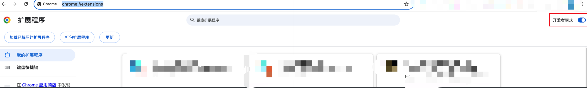
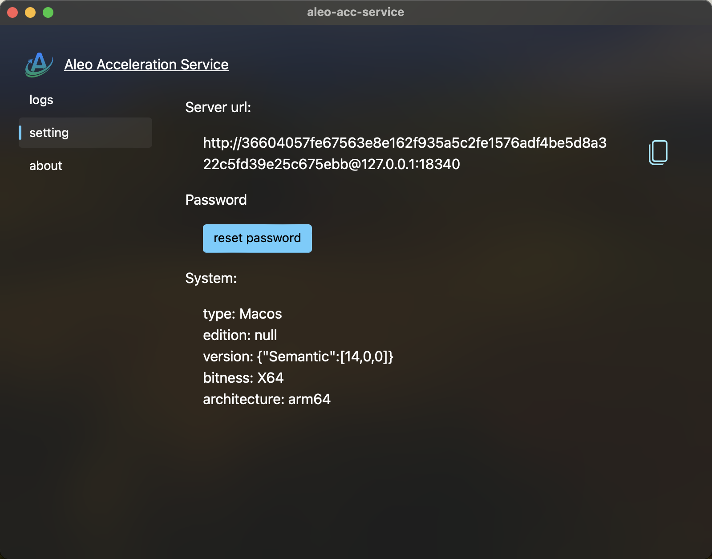
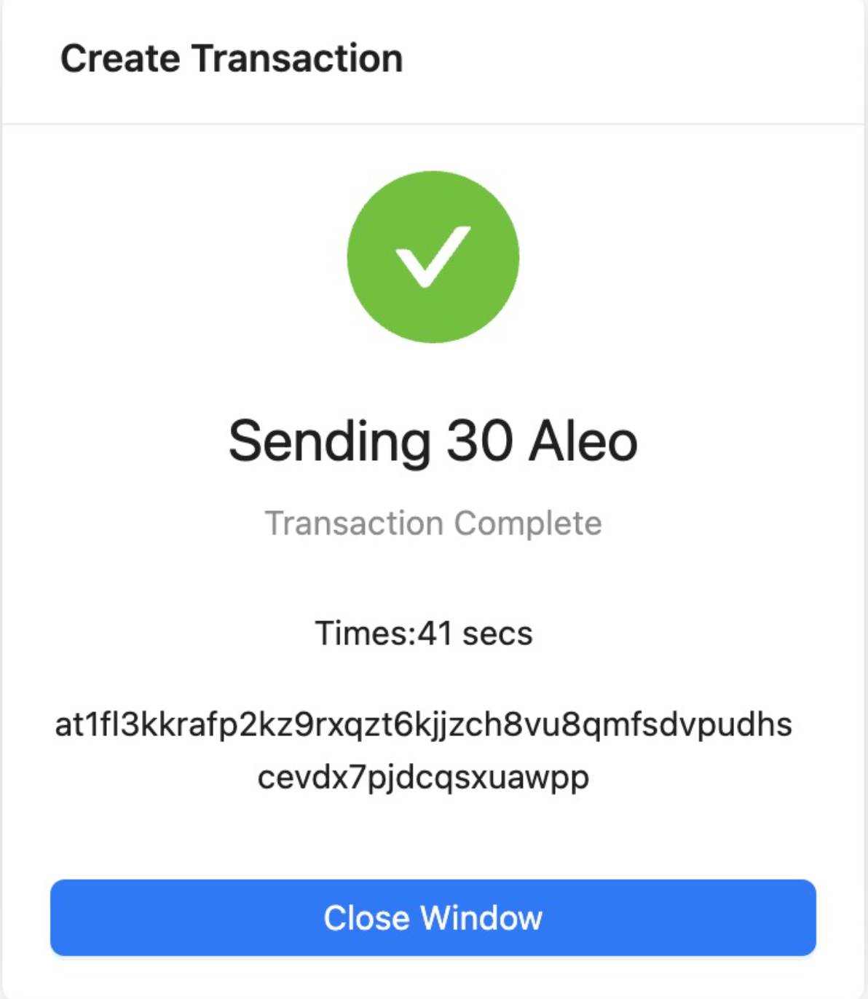

# Aleo Wallet & Acceleration Service

## How to install

### 1.Install aleo-acceleration-service

- [Download](https://github.com/Aleo123Dev/aleo-acceleration-service/releases) the latest released version of your platform. macos(\*.dmg) windows(\*.msi)

#### Mac

- you need to enable application from any source, drag the app to application folder, then run the following command:

```bash
sudo xattr -r -d com.apple.quarantine
sudo xattr -r -d com.apple.quarantine /Applications/aleo-acc-service.app
```

#### Linux

1. Install

Install aleo-acc-service_x.x.x_amd64.AppImage Or aleo-acc-service_x.x.x_amd64.deb

2. Install from source code

Install dependent library
`sudo apt updatesudo apt install libwebkit2gtk-4.0-dev build-essential curl wget libssl-dev libgtk-3-dev libayatana-appindicator3-dev librsvg2-dev`

```shell
git clone git@github.com:Aleo123Dev/aleo-acceleration-service.git
yarn
yarn tauri build
yarn tauri dev
```

#### Windows

Install aleo-acc-service_0.0.x_x64_en-US.msi

### 2. Install Soter Wallet

- [Download](https://github.com/aleoweb123/soter_aleo_wallet/releases) the latest released version.
- Extract the v0.1.2.d.zip file.
- Open chrome://extensions/
  
- Drag the dist/ folder onto the browser.

### 3. Configure the ACC service

- Copy `server url` from ACC service, for example: `http://36604057fe67563e8e162f935a5c2fe1576adf4be5d8a322c5fd39e25c675ebb@127.0.0.1:18340`

- Input the service address on chrome extension:


### 4. Now, when the method is executed, the local service will be called by default

### 5. Test Result "Send"

  
